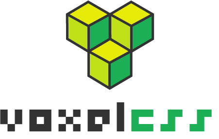

    

 

> Meant to continue the good work started by [Voxel.css](http://www.voxelcss.com/) with modern project architecture, easier contributing, and npm availability.

Roadmap
-------

- Follow progress on [Trello](https://trello.com/b/Q3sVE18k/voxelcss)

## License

